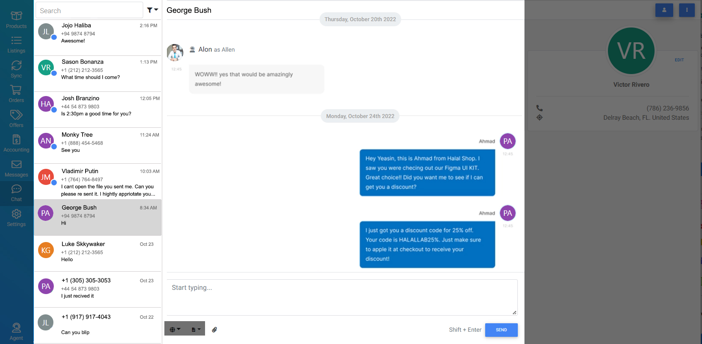

# SMS Communications (Laravel Package)

## Dependencies
* [Laravel 8.x / 9.x](https://laravel.com/docs/8.x)
* [Vue 2.7+](https://v2.vuejs.org)
* [MDBootstrap Vue 6.7.3](https://mdbootstrap.com/docs/b4/vue/)

## Services
* BryteCall
* Nexmo
* Plivo
* Twillio

## Getting Started
Run "php ./configure.php" to run a script that will replace placeholders throughout all the files.

## Description
Create a package that abstracts different SMS services and provides a UI to send, receive, and manage SMS messages.

## Instructions
### Stage 1
* Research features offered by the listed services above besides regular sending and receiving of SMS messages. (i.e - MMS, Mass Messaging, Option to have multiple numbers, etc.)
    * List features that are available for all services.
    * List features that are available for specific services.
* Familiarize yourself with the services listed above, their APIs, and SDKs (if available).
* Review the previous assignment given to a previous developer and the code that was written. [text-messaging-communications](https://github.com/FmTod/text-messaging-comunications)

### Stage 2
* Create an abstraction layer that will allow the package to be used with any of the listed services.
* Routes need to be registered automatically (unless disabled in the config).
* Multiple accounts for each service should be supported.
* Multiple phone numbers for each account should be supported.
* Phone numbers should be able to be blocked (Check if each service supports this, if not, we handle it on our side).

### Stage 3
* Views should be already compiled and ready to be used (see laravel/horizon for reference), with the option to publish the individual components for customization.
* Create a UI that will allow the user to send and receive SMS messages.
    * UI should show a list of conversations grouped by contact phone number and service provider's phone number.
    * UI should show a list of messages for each conversation separated by date.
    * UI should have a dropdown to insert emojis.

## Database Structure
* Create an `accounts` table that will store the credentials for each service. (Account adding will be handled by the application using the package, not the package itself.)
    * `id` - unsigned biginteger - primary key (auto increment)
    * `name` - string (<i><small>Name of Service</small></i>)
    * `email` - string (<i><small>Email used to sign-in to the account</small></i>)
    * `identifier` - string (<i><small>Unique identifier for the account from the service provider</small></i>)
    * `credentials` - json (<i><small>JSON encoded credentials for the account</small></i>)
    * `created_at` - timestamp
    * `updated_at` - timestamp
* Create a `account_phone_numbers` table that will store the phone numbers that can be used to send/receive messages for each account.
    * `id` - unsigned biginteger - primary key (auto increment)
    * `account_id` - unsigned biginteger - foreign key (accounts.id)
    * `value` - string (<i><small>Phone number</small></i>)
    * `created_at` - timestamp
    * `updated_at` - timestamp
* Create a `contacts` table that will store the contacts can be used to store contact name (Note: contact editing will be handled by the application using the package).
    * `id` - unsigned biginteger - primary key (auto increment)
    * `name` - string (<i><small>Name of contact</small></i>)
    * `created_at` - timestamp
    * `updated_at` - timestamp
* Create a `phone_numbers` table that will store the phone numbers for each contact.
    * `id` - unsigned biginteger - primary key (auto increment)
    * `contact_id` unsigned biginteger (nullable) - foreign key (contacts.id)
    * `value` - string (<i><small>Phone number</small></i>)
    * `is_landline` - boolean (<i><small>Is the phone number a landline? Check if this is provided by the API</small></i>)
    * `can_receive_text` - boolean (<i><small>Can the phone number receive text messages? Check if this is provided by the API</small></i>)
    * `has_whatsapp` - boolean (<i><small>Does the phone number have WhatsApp? Check if this is provided by the API</small></i>)
    * `blocked_at` - timestamp - nullable (<i><small>Timestamp of when the phone number was blocked</small></i>)
    * `created_at` - timestamp
    * `updated_at` - timestamp
* Create a `text_messages` table that will store the text messages.
    * `id` - unsigned biginteger - primary key (auto increment)
    * `account_phone_number_id` - unsigned biginteger - foreign key (account_phone_numbers.id)
    * `phone_number_id` - unsigned biginteger - foreign key (phone_numbers.id)
    * `is_incoming` - boolean (<i><small>Is the message incoming or outgoing?</small></i>)
    * `is_unread` - boolean (<i><small>Has the message been read?</small></i>)
    * `body` - text (<i><small>Message body</small></i>)
    * `created_at` - timestamp
    * `updated_at` - timestamp

### Sample UI
#### Main UI
Note: ignore the gray areas, those are part of the app that will use the package

#### Search
Recommendations: [Vue-Multiselect](https://vue-multiselect.js.org) can be used to accomplish this dropdown

